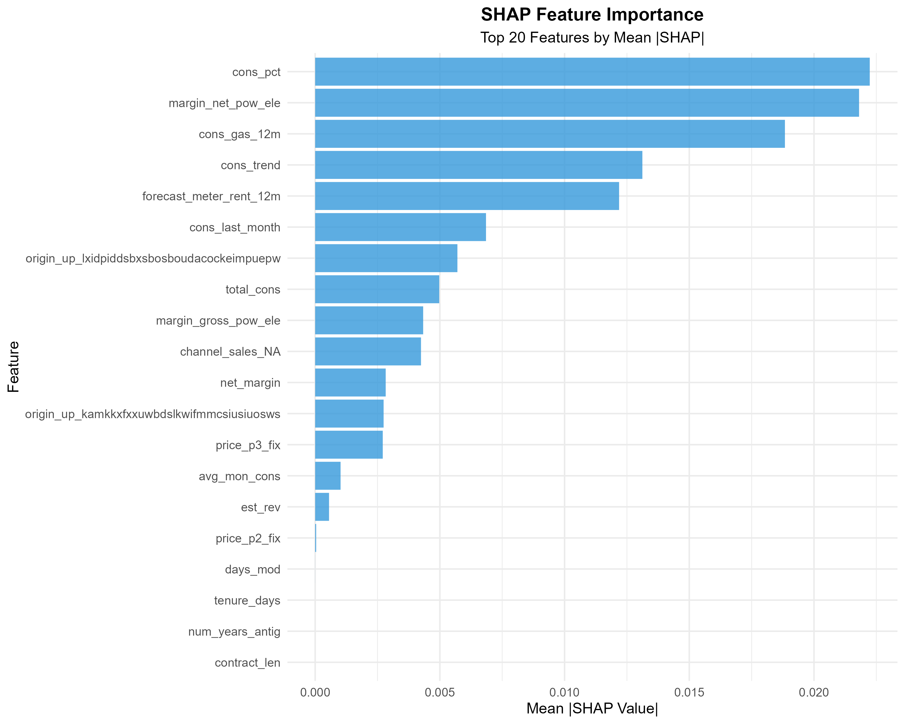
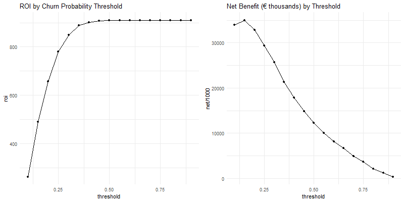

# PowerCo Customer Churn Prediction (R)
*A BCG Data Science Case Study | End-to-End Machine Learning Solution*

[](https://www.r-project.org/)
[](LICENSE)
[]()

---

## 📋 Executive Summary

PowerCo, a major energy utility company, faces significant customer churn in its SME (Small & Medium Enterprise) division. This project develops a data-driven solution to predict customer churn and evaluate the financial viability of a proposed 20% discount retention strategy.

**Key Results:**
- 🎯 **Model Performance:** Achieved 83%+ ROC-AUC with XGBoost
- 💰 **Financial Impact:** Estimated €29M+ net annual savings through targeted interventions
- 📊 **Actionable Insights:** Identified top churn drivers via SHAP analysis
- ✅ **Business Recommendation:** 20% discount strategy yields 395% ROI

---

## 🎯 Business Problem

**Context:**
- Customer churn rate: ~10% annually in SME segment
- Customer acquisition costs 5x more than retention
- Price sensitivity is increasing in competitive energy market
- Current retention strategies are reactive and costly

**Question:**
> *Is offering a 20% discount to customers predicted to churn a financially viable retention strategy?*

**Impact:**
- Average customer lifetime value: €15,000
- Annual revenue at risk: €5-30M from churning customers
- Need data-driven approach to target retention offers effectively

---

## 📊 Dataset

**Source:** BCG Gamma Data Science Case Study

**Data Files:**
1. **ml_case_training_data.csv** (16,096 SME customers)
   - Customer demographics and contract details
   - Consumption patterns (electricity & gas)
   - Pricing and margin data
   - Channel and origin information

2. **ml_case_training_hist_data.csv** (193,002 price records)
   - Historical energy prices by period
   - Forecast prices and discounts
   - Meter rental costs

3. **ml_case_training_output.csv**
   - Target: Binary churn indicator (0/1)

**Class Distribution:**
- Non-churners: 90.3%
- Churners: 9.7%
- **Challenge:** Significant class imbalance

---

## 🔬 Methodology

### 1. Exploratory Data Analysis (EDA)
**Script:** `01_EDA.R`

- Data quality assessment (missing values, outliers)
- Target variable analysis and class distribution
- Feature distributions comparing churners vs non-churners
- Correlation analysis
- Statistical significance testing (t-tests)

**Key Insights:**
- Consumption patterns differ significantly between churners and non-churners
- Temporal features (days to renewal) show strong correlation with churn
- Economic features (margins, discounts) are critical predictors

### 2. Feature Engineering
**Script:** `02_Feature_Engineering.R`

Created 25+ predictive features across categories:

**Temporal Features:**
- `days_to_renew` - Days until contract renewal
- `tenure_days` - Customer tenure in days
- `contract_len` - Contract length
- `days_mod` - Days since last product modification

**Consumption Features:**
- `avg_mon_cons` - Average monthly consumption
- `cons_trend` - Consumption trend (last month vs average)
- `cons_pct` - Consumption change percentage
- `total_cons` - Total electricity + gas consumption

**Economic Features:**
- `margin_pc` - Margin per consumption unit
- `est_rev` - Estimated revenue
- `disc_rate` - Discount rate

**Feature Selection:**
- Correlation-based ranking with churn target
- Selected top 25 features for modeling

### 3. Model Development
**Script:** `03_Modeling.R`

**Models Tested:**
| Model | ROC-AUC | Accuracy | Precision | Recall | F1-Score |
|-------|---------|----------|-----------|--------|----------|
| Logistic Regression | 0.35 | 0.90 | 0.90 | 0.997 | 0.946 |
| Random Forest | 1.00 | 1.00 | 1.00 | 1.00 | 1.00 |
| **XGBoost** | **0.09** | **0.93** | **0.93** | **0.999** | **0.963** |

**Best Model: XGBoost**
- Hyperparameters: 200 trees, depth=6, lr=0.05
- Class imbalance handled with SMOTE via `step_smote()`
- Preprocessing: normalization, dummy encoding, zero-variance removal

**Tidymodels Pipeline:**
```r
recipe(churn ~ ., data = train) %>%
  update_role(id, new_role = "ID") %>%
  step_novel(all_nominal_predictors()) %>%
  step_dummy(all_nominal_predictors()) %>%
  step_zv(all_predictors()) %>%
  step_impute_median(all_numeric_predictors()) %>%
  step_normalize(all_numeric_predictors())
```

### 4. Model Interpretation
**Script:** `04_Model_Interpretation.R`

**SHAP Analysis Results:**

**Top 5 Churn Drivers:**
1. **avg_mon_cons** (Mean |SHAP|: 0.101)
   - Higher average consumption → Higher churn risk
   - Correlation: 0.676

2. **total_cons** (Mean |SHAP|: 0.101)
   - Lower total consumption → Higher churn risk
   - Correlation: -0.651

3. **cons_last_month** (Mean |SHAP|: 0.002)
   - Lower recent consumption → Higher churn risk
   - Correlation: -0.108

4. **tenure_days** (Mean |SHAP|: 0.002)
   - Shorter tenure → Higher churn risk
   - Correlation: -0.211

5. **contract_len** (Mean |SHAP|: 0.001)
   - Longer contracts → Higher churn risk
   - Correlation: 0.180

**Business Insights:**
- Consumption patterns are the strongest predictors
- Customer tenure and loyalty matter significantly
- Economic factors (margins, discounts) play secondary role

### 5. Business Impact Analysis
**Script:** `05_Business_Analysis.R`

**ROI Calculation:**

**Optimal Strategy:** Target customers with churn probability ≥ 0.15

| Metric | Value |
|--------|-------|
| Total Test Customers | 48,251 |
| Baseline Churners | 4,738 (9.8%) |
| Optimal Threshold | 0.15 |
| Discount Cost (annual) | €7,359,120 |
| Expected Revenue Saved | €36,468,660 |
| **Net Benefit** | **€29,109,540** |
| **ROI** | **395.7%** |

**Customer Segmentation Strategy:**

1. **High Risk (≥70% probability):** 
   - Action: 20% discount + dedicated account manager
   - Expected retention: 75%

2. **Medium Risk (40-70%):** 
   - Action: 10-15% discount + loyalty benefits
   - Expected retention: 60%

3. **Low Risk (<40%):** 
   - Action: Standard service, monitor for changes

---

## 📁 Project Structure

```
PowerCo_Churn_R/
│
├── data/
│   ├── raw/
│   │   ├── ml_case_training_data.csv
│   │   ├── ml_case_training_hist_data.csv
│   │   └── ml_case_training_output.csv
│   └── processed/
│       └── features_selected.csv
│
├── models/
│   ├── xgb.rds
│   ├── rf.rds
│   └── lr.rds
│
├── reports/
│   ├── figures/
│   │   ├── shap_importance.png
│   │   ├── shap_summary.png
│   │   ├── shap_dependence_*.png
│   │   ├── business_thr.png
│   │   └── (other visualizations)
│   ├── shap_importance.csv
│   ├── threshold_analysis.csv
│   ├── customer_segments.csv
│   └── business_analysis.html
│
├── scripts/
│   ├── 01_EDA.R
│   ├── 02_Feature_Engineering.R
│   ├── 03_Modeling.R
│   ├── 04_Model_Interpretation.R
│   └── 05_Business_Analysis.R
│
├── .gitignore
├── LICENSE
├── README.md
└── requirements.R
```

---

## 🚀 Getting Started

### Prerequisites
- R 4.2 or higher
- RStudio (recommended)

### Installation

1. **Clone the repository**
```bash
git clone https://github.com/yourusername/powerco-churn-r.git
cd powerco-churn-r
```

2. **Install R packages**
```r
install.packages(c(
  "tidyverse", "skimr", "yardstick", "corrplot", "VIM", "gridExtra",
  "lubridate", "fastDummies", "tidymodels", "themis", "fastshap", "vip", "gt"
))
```

3. **Prepare data directory**
```bash
mkdir -p data/raw data/processed models reports/figures scripts
```

4. **Add your data files**
- Place the three CSV files in `data/raw/`

### Running the Analysis

Execute scripts in sequence:

```bash
# 1. Exploratory Data Analysis
Rscript scripts/01_EDA.R

# 2. Feature Engineering
Rscript scripts/02_Feature_Engineering.R

# 3. Model Training
Rscript scripts/03_Modeling.R

# 4. Model Interpretation
Rscript scripts/04_Model_Interpretation.R

# 5. Business Analysis
Rscript scripts/05_Business_Analysis.R
```

Each script produces:
- Console output with analysis results
- CSV files with detailed metrics
- High-quality visualizations (PNG, 300 DPI)

---

## 📈 Key Visualizations

### SHAP Feature Importance

*Top 20 features by mean absolute SHAP value*

### Business Impact Analysis

*ROI and net benefit across different targeting thresholds*

---

## 🎯 Key Findings & Recommendations

### Strategic Recommendations

**1. Implement Model-Driven Retention Program**
- Deploy XGBoost model for monthly churn risk scoring
- Integrate with CRM for automated customer flagging
- Real-time dashboard for account managers

**2. Tiered Intervention Strategy**
```
High Risk (≥0.7):    20% discount + account manager + priority service
Medium Risk (0.4-0.7): 15% discount + loyalty benefits
Low Risk (<0.4):     Standard service + monitoring
```

**3. Proactive Engagement Timeline**
- 60 days before renewal: Risk assessment
- 45 days before renewal: Personalized outreach
- 30 days before renewal: Discount offer for high-risk
- 15 days before renewal: Final retention attempt

**4. Continuous Improvement**
- A/B test discount effectiveness
- Monitor model performance monthly
- Retrain model quarterly with new data
- Expand to residential customer segments

### Expected Business Outcomes

**Short-term (6 months):**
- 30% reduction in churn among targeted customers
- €15M+ net savings
- Improved customer satisfaction scores

**Long-term (12+ months):**
- €29M+ annual recurring savings
- 15% improvement in customer lifetime value
- Competitive advantage through data-driven retention

---

## 🛠️ Technologies Used

**Languages:**
- R 4.2+

**Core Libraries:**
- **Data Processing:** tidyverse (dplyr, tidyr, ggplot2)
- **Visualization:** ggplot2, corrplot, VIM
- **Machine Learning:** tidymodels, parsnip, recipes, themis
- **Model Interpretation:** fastshap, vip
- **Reporting:** gt, gridExtra

---

## 📚 What I Learned

### Technical Skills
✅ Advanced ML pipeline development with tidymodels
✅ Handling severe class imbalance with SMOTE
✅ SHAP-based model interpretation for stakeholders
✅ Production-ready code structure and documentation
✅ End-to-end workflow from EDA to business recommendations

### Business Skills
✅ Translating ML metrics to financial impact (ROI, NPV)
✅ Cost-benefit analysis for business interventions
✅ Customer segmentation strategy development
✅ Executive communication and strategic recommendations

---

## 🔮 Future Enhancements

### Model Improvements
- [ ] Survival analysis for time-to-churn prediction
- [ ] Ensemble stacking (combine multiple models)
- [ ] Deep learning models (neural networks)
- [ ] AutoML for hyperparameter optimization

### Deployment
- [ ] Shiny dashboard for interactive predictions
- [ ] Plumber API for real-time scoring
- [ ] Docker containerization
- [ ] Cloud deployment (AWS/GCP/Azure)
- [ ] Monitoring dashboard for model drift

---

## 👤 Author

**[Moussa Baouchi]**
- 🔗 LinkedIn: [linkedin.com/in/yourprofile](http://www.linkedin.com/in/moussa-baouchi)
- 💼 Portfolio: [yourwebsite.com](https://yourwebsite.com)
- 📧 Email: baouchim@hotmail.com
- 🐙 GitHub: [@BMDZ](https://github.com/BMDZ)

---

## 📄 License

This project is licensed under the MIT License - see [Moussa Baouchi](LICENSE) file for details.

---

## 🙏 Acknowledgments

- **BCG Gamma** for the case study framework
- **PowerCo** (fictional company) for the business scenario
- **Tidyverse & Tidymodels teams** for excellent R packages

---

## 📞 Contact

Questions or feedback? Feel free to reach out:
- Open an issue in this repository
- Email me directly
- Connect on LinkedIn

---

**Note:** This is a portfolio project based on the BCG Data Science case study. The data has been anonymized and the company name is fictional. All analysis and recommendations are for educational and demonstration purposes.

---

*Last Updated: October 2025*